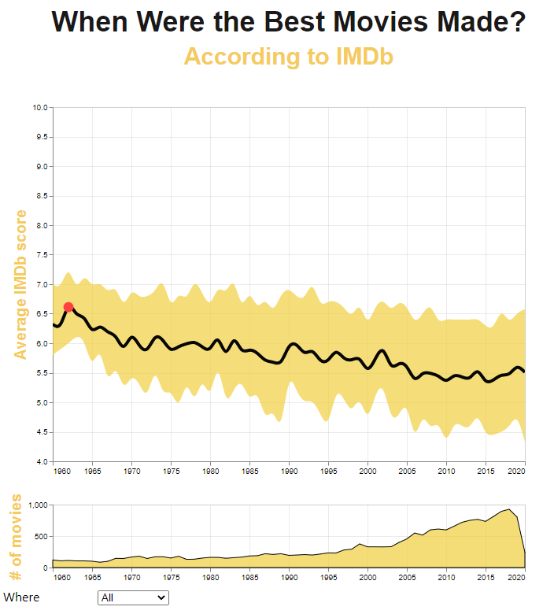
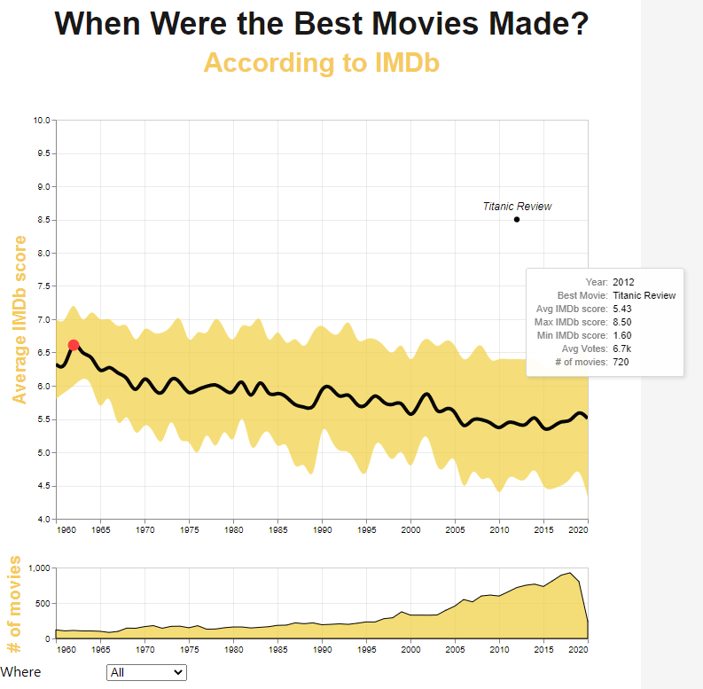
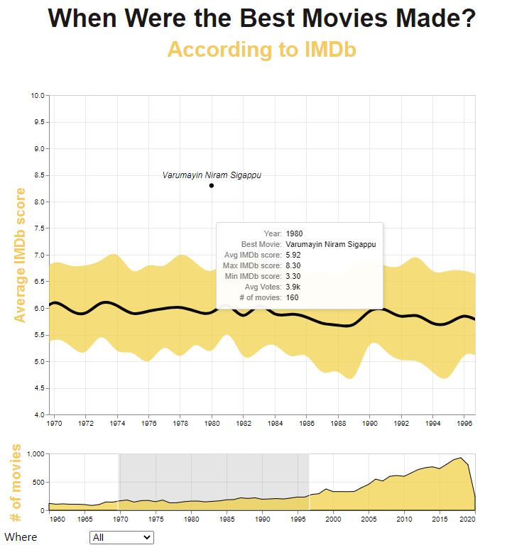
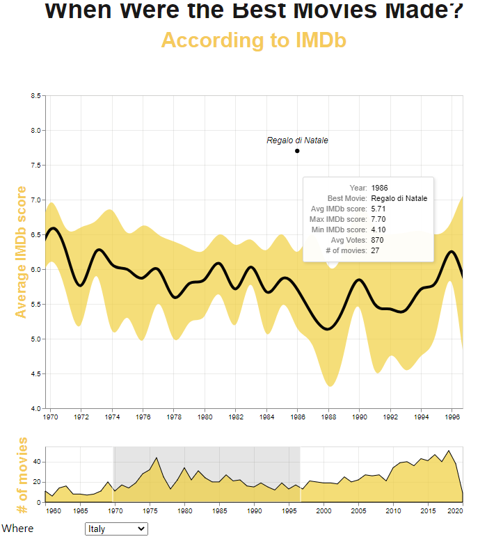

# Dataviz IMDB

Through vega lite my colleges and me, using the IMDB dataset, we createed a interactive visualization to show:

- Trend of the average IMDb score and its inter-quartile range for movies from 1960 to 2020, grouped for the country of production. 
- For each geographical area, the year with the highest average IMDb score has been identified through a red point. 
- For each year, it's shown the best rated movie for the selected geographical area









source data: https://www.imdb.com/

```json
require 'redcarpet'
markdown = Redcarpet.new("Hello World!")
puts markdown.to_html
```
